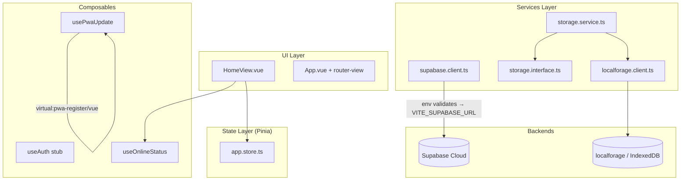

# Design: Foundation

> **Change**: `foundation` | **Phase**: `sdd-design`
> **Proposal**: `openspec/changes/foundation/proposal.md`
> **Spec**: `openspec/changes/foundation/spec.md`
> **Exploration**: `openspec/changes/foundation/exploration.md`
>
> This design is PR-AGNOSTIC — it defines architecture, patterns, and rationale. PR grouping in §13 is a HINT for `sdd-tasks`, not a hard rule.

---

## 1. Architecture Overview

kilo-lima is a single-user Vue 3.5 SPA with Vuetify 3.12 UI, Pinia 3.0 state, and Vue Router 4.6 lazy-loaded routing. The backend is Supabase Cloud (free tier, accessed via `@supabase/supabase-js` v2.108). Offline resilience comes from `localforage` 1.10 (IndexedDB) behind the `IStorageService` LSP contract and a `vite-plugin-pwa` 1.3 service worker (`generateSW`). Build and test run on Vite 5.4 + Vitest 2.1 with jsdom. Zod 4.4 validates environment variables at module-import time (fail-fast). The app MUST boot without network — connectivity is only needed for Supabase sync.



**Key invariant**: `src/main.ts` does not await any network call. The Vite dev server, the production `dist/`, and the Vitest runner all boot without touching Supabase or the network.

---

## 2. Plugin Registration Order

Exact order in `src/main.ts`:

```ts
import { createApp } from 'vue'
import { createPinia } from 'pinia'
import { router } from '@/router'
import { vuetify } from '@/plugins/vuetify'
import App from '@/App.vue'
import { supabase, storageService } from '@/plugins/services'

const app = createApp(App)
app.use(createPinia())     // 1. Pinia — before router (guards may read stores)
app.use(router)            // 2. Router — before mount (navigation starts)
app.use(vuetify)           // 3. Vuetify — before mount (components need <v-app>)
app.provide('supabase', supabase)            // 4. DI singletons
app.provide('storageService', storageService)
app.mount('#app')          // 5. Mount — always last
```

**WHY this order**:
- Pinia before Router: Vue Router navigation guards (`beforeEach`) may call `useAppStore()`. If Pinia is not installed, the guard crashes.
- Provide before mount: Components mounted during the initial navigation may `inject('supabase')`. If the provide hasn't run, they receive `undefined`.
- Mount always last: Vue resolves the full plugin graph before rendering, avoiding partial-state bugs.

**Pattern**: A thin `src/plugins/services.ts` builds the singletons and re-exports them. This keeps `main.ts` under 30 lines and makes the dependency graph inspectable in one file.

---

## 3. Service Singletons Pattern

| File | Singleton | Why |
|------|-----------|-----|
| `src/services/supabase.client.ts` | `export const supabase = createClient<Database>(env.SUPABASE_URL, env.SUPABASE_ANON_KEY)` | One TCP connection, consistent auth state |
| `src/services/localforage.client.ts` | `export const localforageInstance = localforage.createInstance({ name: 'kilo-lima', storeName: 'kilo_lima_store' })` | One IndexedDB database handle |
| `src/services/storage.service.ts` | `export const storageService: IStorageService = new LocalforageStorageService(localforageInstance)` | LSP contract wired to localforage singleton |

**Why singletons**: Avoids N client instances (multiple Supabase connections, multiple IndexedDB handles). Easier to mock in tests: swap one import.

**Why ALSO provide via DI**: `app.provide('storageService', storageService)` enables swapping `storageService` for an in-memory test double without touching consumers. The `inject` path is discoverable via Vue DevTools. Components and future composables use `inject<string, IStorageService>('storageService')`.

---

## 4. Environment Validation Flow

```
Vite loads .env.local
     ↓
module import: src/utils/env.ts
     ↓
Zod schema validates VITE_SUPABASE_URL (url()) + VITE_SUPABASE_ANON_KEY (min(1))
     ↓
┌─ valid → exports typed `env` object
└─ invalid → throws ZodError immediately (app never mounts)
```

**Files involved**:
- `src/utils/env.ts` — Zod schema + `envSchema.parse(import.meta.env)`, exported as `env`
- `env.d.ts` — augments `ImportMetaEnv` with `VITE_SUPABASE_URL: string` and `VITE_SUPABASE_ANON_KEY: string`
- `.env.example` — documents both vars with placeholder values
- `src/services/supabase.client.ts` — imports `{ env }` from `@/utils/env` at the top; if env is invalid, `createClient` is never called

**Why fail-fast at module import**: Cryptic Supabase errors ("Invalid URL") appearing 10 seconds into the app boot are worse than a boot-time crash with a clear Zod message listing the exact missing variable.

**Trade-off**: Zod 4 adds ~12 KB gzipped. Acceptable — Vuetify alone is ~50 KB gzipped, and the PWA shell is precached once.

---

## 5. PWA Registration Flow

**vite.config.ts** — `VitePWA` plugin:

```ts
VitePWA({
  registerType: 'autoUpdate',
  manifest: {
    name: 'Kilo-Lima',
    short_name: 'KiloLima',
    theme_color: '#1976D2',
    background_color: '#FAFAFA',
    display: 'standalone',
    icons: [
      { src: '/icons/icon-192.png', sizes: '192x192', type: 'image/png' },
      { src: '/icons/icon-512.png', sizes: '512x512', type: 'image/png' },
      { src: '/icons/maskable-512.png', sizes: '512x512', type: 'image/png', purpose: 'maskable' },
    ],
  },
  workbox: {}, // defaults are fine for foundation
  devOptions: { enabled: true },
})
```

**Composables**:
- `src/composables/usePwaUpdate.ts`: wraps `virtual:pwa-register/vue` → exposes `{ needRefresh, offlineReady, updateServiceWorker }`. This is the ONLY consumer of the virtual module.
- `src/composables/useOnlineStatus.ts`: returns `{ online: Ref<boolean> }` from `navigator.onLine` + `online`/`offline` window events.

**Why `autoUpdate`**: Zero-friction updates for a single-user app; manual prompt UI is a later-slice concern.

**Trade-off**: `autoUpdate` can disrupt mid-session (new SW activates on next page load without warning). Acceptable because there is only one user, they can refresh, and the offline-sync slice will add a custom SW with explicit update control.

---

## 6. IStorageService Contract (LSP)

```ts
// src/services/storage.interface.ts
export interface IStorageService {
  guardar<T>(clave: string, datos: T): Promise<void>
  obtener<T>(clave: string): Promise<T | null>
  eliminar(clave: string): Promise<void>
  listarClaves(): Promise<string[]>
}
```

`LocalforageStorageService` in `src/services/storage.service.ts` implements this against `localforageInstance`.

**Spanish method names** per conventions: business logic identifiers use Spanish (`guardar`, `obtener`, `eliminar`, `listarClaves`).

**WHY an interface now** even with one implementation:
- Future slice `offline-sync` adds `SupabaseStorageService` for server-backed reads.
- `MemoryStorageService` for tests (no IndexedDB dependency).
- Consumers (future `useIngredientes`, `useRecetas`, `useEventos`, `useSyncQueue`) never change — they depend on `IStorageService`, not on `localforage`.

---

## 7. useAuth Stub Pattern

`src/composables/useAuth.ts` returns:

```ts
{
  usuarioActual: Ref<User | null>, // ref(null)
  sesionActiva: Ref<boolean>,       // ref(false)
  cargando: Ref<boolean>,           // ref(false)
  iniciarSesion: (email: string, password: string) => Promise<void>, // throws
  cerrarSesion: () => Promise<void>,                                 // throws
  obtenerUsuarioActual: () => Promise<User | null>,                  // throws
  registrar: (email: string, password: string) => Promise<void>,     // throws
}
```

All throwing methods throw `new Error('No implementado: el flujo de autenticación llega en un slice posterior')`.

**WHY a stub and not just empty**: Makes the type contract explicit. Components can safely destructure `{ usuarioActual, cargando }` and bind them reactively; when the real implementation (`auth-flow` slice) replaces the stub, no consumer API surface changes. Throwing prevents accidental "looks working" UI (a silent no-op on `iniciarSesion` would be a subtle bug).

---

## 8. State Management Pattern

| Decision | Choice | Rationale |
|----------|--------|-----------|
| Store library | Pinia 3.0, setup-style (Composition API) | Locked by brief §5.2. Setup-style is consistent with `<script setup>` components, has better TS inference, and no `this` ambiguity. |
| Store granularity | One store per domain | `brief.md` §4.1: `ingredients.store.ts`, `recipes.store.ts`, `events.store.ts`, `pos.store.ts`, `reports.store.ts`. Foundation ships only `app.store.ts` as pattern proof. |
| Store naming | `{domain}.store.ts` | Consistent with brief §5.3 conventions. |

`src/stores/app.store.ts` is a proof-of-pattern store:
```ts
export const useAppStore = defineStore('app', () => {
  const appName = ref('Kilo-Lima')
  function setAppName(name: string) { appName.value = name }
  return { appName, setAppName }
})
```

---

## 9. Routing Pattern

| Decision | Choice | Rationale |
|----------|--------|-----------|
| History mode | `createWebHistory(import.meta.env.BASE_URL)` | Clean URLs without hash fragments; `BASE_URL` respects Vite's `base` config for Cloudflare Pages. |
| File separation | `src/router/routes.ts` (definitions) + `src/router/index.ts` (setup) | Keeps `index.ts` under 30 lines; future slices add routes without touching router setup. |
| Lazy loading | `component: () => import('@/views/HomeView.vue')` | Code splitting from day 1 — avoids a refactor when adding the second route. |
| Catch-all | `{ path: '/:pathMatch(.*)*', redirect: '/' }` | Typing a wrong URL redirects to home instead of blank page. |

Foundation has exactly one route (`/`). The catch-all handles all unmatched paths.

---

## 10. Theme & Design Tokens

`src/plugins/vuetify.ts`:

```ts
createVuetify({
  theme: {
    defaultTheme: 'light',
    themes: {
      light: {
        dark: false,
        colors: {
          primary: '#1976D2',
          secondary: '#424242',
          accent: '#FF6B35',
          success: '#4CAF50',
          warning: '#FFC107',
          error: '#F44336',
          background: '#FAFAFA',
        },
      },
    },
  },
})
```

**No dark theme. No theme toggle.** (Preflight 5A wins over brief §1 line 20.)

**WHY `accent #FF6B35` (orange)**: The brief calls it the "color de ventas" — the emotional signal at the POS. Used by future sale-confirmation toasts and POS buttons.

**`vite-plugin-vuetify` registered FIRST** in `vite.config.ts` plugins array (before `@vitejs/plugin-vue`) — required for auto-import and tree-shaking.

---

## 11. Type Strategy for Supabase

Foundation ships a hand-authored `Database` stub:

```ts
// src/types/database.types.ts
export interface Database {
  public: {
    Tables: {}
    Views: {}
    Functions: {}
    Enums: {}
  }
}
```

**WHY a stub**: Foundation has no live Supabase project, so `supabase gen types` would fail. The empty `Tables` lets `createClient<Database>` type-check. A header comment documents this as a stub to be regenerated.

**Future CI slice**: Runs `npx supabase gen types typescript --project-id $SUPABASE_PROJECT_ID --schema public > src/types/database.types.ts` prebuild when a real Supabase project exists.

**Trade-off**: Types drift silently until regeneration. Documented in the file comment as a known gap.

---

## 12. Test Setup Architecture

| File | Purpose |
|------|---------|
| `vitest.config.ts` | Extends `vite.config.ts` via `mergeConfig`; sets `test: { environment: 'jsdom', globals: true, setupFiles: ['./tests/setup.ts'] }` |
| `tests/setup.ts` | Mocks `window.matchMedia` (Vuetify requires it). Stubs `localforage` with in-memory `Map`. |
| `src/views/HomeView.spec.ts` | Mounts `HomeView` with `global: { plugins: [createPinia()] }`. Asserts: `<h1>` contains "Kilo-Lima", subtitle contains "Pre-evento", store `appName` visible, online status text present. |

**Why jsdom (not happy-dom)**: Better Vue 3 + Vuetify compatibility, especially for `matchMedia` and CSS custom property emulation.

**`strict_tdd`**: Stays `false` in `openspec/config.yaml` until this smoke test passes green; orchestrator flips it to `true` in the next session.

---

## 13. File → Requirement Traceability

### Tooling & Build

| REQ | Files |
|-----|-------|
| REQ-TOOL-1 | `package.json` (scripts.dev), `vite.config.ts` |
| REQ-TOOL-2 | `vite.config.ts` (build), `package.json` (scripts.build) |
| REQ-TOOL-3 | `tsconfig.json` (strict: true), `package.json` (scripts.typecheck = `vue-tsc --noEmit`) |
| REQ-TOOL-4 | `eslint.config.js`, `package.json` (scripts.lint) |
| REQ-TOOL-5 | `.prettierrc.json`, `package.json` (scripts.format) |
| REQ-TOOL-6 | `vitest.config.ts`, `package.json` (scripts.test) |
| REQ-TOOL-7 | `pnpm-lock.yaml` (generated by `pnpm install`) |

### Application Shell

| REQ | Files |
|-----|-------|
| REQ-SHELL-1 | `src/main.ts`, `src/plugins/services.ts` |
| REQ-SHELL-2 | `src/App.vue` |
| REQ-SHELL-3 | Folder structure: `src/components/ui/`, `src/components/business/`, `src/composables/`, `src/stores/`, `src/services/`, `src/views/`, `src/types/`, `src/utils/` |

### UI Framework

| REQ | Files |
|-----|-------|
| REQ-UI-1 | `vite.config.ts` (vite-plugin-vuetify before Vue), `src/plugins/vuetify.ts` |
| REQ-UI-2 | `src/plugins/vuetify.ts` (theme colors) |
| REQ-UI-3 | `src/views/HomeView.vue` (renders at least one Vuetify component) |
| REQ-UI-4 | `src/plugins/vuetify.ts` (only `light` theme key; no `dark` block) |

### State Management

| REQ | Files |
|-----|-------|
| REQ-STATE-1 | `src/main.ts` (createPinia), `package.json` (pinia dep) |
| REQ-STATE-2 | `src/stores/app.store.ts` |

### Backend Client

| REQ | Files |
|-----|-------|
| REQ-BE-1 | `src/services/supabase.client.ts`, `package.json` (@supabase/supabase-js) |
| REQ-BE-2 | `src/services/supabase.client.ts`, `src/utils/env.ts` |
| REQ-BE-3 | `src/utils/env.ts` (Zod schema) |
| REQ-BE-4 | `env.d.ts` (ImportMetaEnv augmentation) |
| REQ-BE-5 | `.env.example` |

### Offline Skeleton

| REQ | Files |
|-----|-------|
| REQ-OFF-1 | `src/services/localforage.client.ts`, `package.json` (localforage) |
| REQ-OFF-2 | `src/services/storage.interface.ts` |
| REQ-OFF-3 | `src/services/storage.service.ts` |
| REQ-OFF-4 | `docs/offline-sync.md` |

### Auth Scaffold

| REQ | Files |
|-----|-------|
| REQ-AUTH-1 | `src/services/supabase.client.ts` (Auth namespace is part of the client) |
| REQ-AUTH-2 | `src/composables/useAuth.ts` (all methods throw) |
| REQ-AUTH-3 | `src/composables/useAuth.ts` (reactive refs present, initialized to null/false) |
| REQ-AUTH-4 | Negative requirement — no login UI anywhere in `src/` |

### PWA Skeleton

| REQ | Files |
|-----|-------|
| REQ-PWA-1 | `vite.config.ts` (VitePWA config) |
| REQ-PWA-2 | `public/icons/icon-192.png`, `public/icons/icon-512.png`, `public/icons/maskable-512.png` |
| REQ-PWA-3 | `vite.config.ts` (generateSW strategy — default) |
| REQ-PWA-4 | `src/composables/usePwaUpdate.ts` |
| REQ-PWA-5 | `src/composables/useOnlineStatus.ts` |

### Routing

| REQ | Files |
|-----|-------|
| REQ-ROUTE-1 | `src/router/index.ts`, `src/router/routes.ts` |
| REQ-ROUTE-2 | `src/router/routes.ts` (lazy import of HomeView) |
| REQ-ROUTE-3 | `src/router/routes.ts` (catch-all `/:pathMatch(.*)*` redirect to `/`) |

### Home View

| REQ | Files |
|-----|-------|
| REQ-HOME-1 | `src/views/HomeView.vue` (`<h1>Kilo-Lima</h1>`) |
| REQ-HOME-2 | `src/views/HomeView.vue` (subtitle: "Pre-evento · Durante evento · Post-evento") |
| REQ-HOME-3 | `src/views/HomeView.vue` (consumes `useOnlineStatus`, renders "En línea" / "Sin conexión") |
| REQ-HOME-4 | `src/views/HomeView.vue` (consumes `useAppStore`, displays `appName`) |
| REQ-HOME-5 | `src/views/HomeView.vue` (Composition API `<script setup>`, ≤ 200 lines) |

### Testing

| REQ | Files |
|-----|-------|
| REQ-TEST-1 | `vitest.config.ts`, `package.json` (vitest, jsdom) |
| REQ-TEST-2 | `package.json` (@vue/test-utils dev dep) |
| REQ-TEST-3 | `tests/setup.ts` |
| REQ-TEST-4 | `src/views/HomeView.spec.ts` |
| REQ-TEST-5 | `package.json` (scripts.test), `vitest.config.ts` |

### Conventions & Quality Gates

| REQ | Files |
|-----|-------|
| REQ-CONV-1 | All `.vue` files ≤ 200 lines (enforced by review) |
| REQ-CONV-2 | All functions ≤ 30 lines (enforced by review) |
| REQ-CONV-3 | No forbidden deps: grep-verified across `src/`, `package.json` |
| REQ-CONV-4 | All UI strings in Spanish in `src/views/HomeView.vue` |
| REQ-CONV-5 | Spanish business identifiers, English infrastructure filenames |
| REQ-CONV-6 | "Why" comments only — verified by review |
| REQ-CONV-7 | `README.md` |

---

### Proposed PR Grouping (HINT for `sdd-tasks`)

This grouping balances capability coherence with the 400-line review budget. `sdd-tasks` MAY refine it.

**PR1 — Bootable shell** (`~250 lines`): REQ-TOOL-1..7, REQ-SHELL-1..3, REQ-UI-1..4, REQ-CONV-7 (README), REQ-PWA-1..3
- Root config files: `package.json`, `tsconfig*.json`, `vite.config.ts`, `eslint.config.js`, `.prettierrc.json`, `.editorconfig`, `env.d.ts`, `.env.example`, `index.html`, `README.md`
- Entry + plugins: `src/main.ts`, `src/App.vue`, `src/plugins/vuetify.ts`, `src/plugins/services.ts`
- PWA: `vite.config.ts` PWA block, `public/icons/*.png`, `public/favicon.ico`, `public/robots.txt`
- Folder structure: empty `src/components/ui/`, `src/components/business/`

**PR2 — Router + stores + utils + types** (`~200 lines`): REQ-STATE-1..2, REQ-ROUTE-1..3, REQ-HOME-1..5, REQ-BE-3..5, REQ-CONV-1..6
- Router: `src/router/index.ts`, `src/router/routes.ts`
- Store: `src/stores/app.store.ts`
- View: `src/views/HomeView.vue`
- Utils: `src/utils/env.ts`, `src/utils/format.ts`
- Types: `src/types/database.types.ts`, `src/types/index.ts`

**PR3 — Services + auth stub** (`~200 lines`): REQ-BE-1..2, REQ-OFF-1..3, REQ-AUTH-1..4
- Services: `src/services/supabase.client.ts`, `src/services/localforage.client.ts`, `src/services/storage.interface.ts`, `src/services/storage.service.ts`
- Composable: `src/composables/useAuth.ts`

**PR4 — PWA composables + offline docs + smoke test** (`~200 lines`): REQ-PWA-4..5, REQ-OFF-4, REQ-TEST-1..5
- Composables: `src/composables/usePwaUpdate.ts`, `src/composables/useOnlineStatus.ts`
- Docs: `docs/offline-sync.md`
- Test: `vitest.config.ts`, `tests/setup.ts`, `src/views/HomeView.spec.ts`

**WHY this grouping**: Each PR is a coherent capability slice; `main` stays green at every merge. The smoke test lands in PR4 because PWA composables + online status + store value all need to exist for it to be meaningful.

---

## 14. Risks & Mitigations (Architecture-Level)

| # | Risk | Likelihood | Mitigation |
|---|------|------------|------------|
| 1 | Vuetify 3.12 is the last 3.x line (Vuetify 4 is current) | Med | Pin to 3.12.8. Document migration path in a future `vuetify-4-migration` slice. |
| 2 | `localforage` unmaintained since 2021 | Low | Wrapped behind `IStorageService`. If it breaks, only `LocalforageStorageService` changes — consumers unaffected. |
| 3 | ESLint 9 flat config is a different mental model | Low | Use minimal flat config with `vue` + `typescript-eslint` recommended presets; no custom rules in foundation. |
| 4 | Vitest 2.x ↔ Vite 5.x coupling | Low | Pin Vitest 2.1.9 with Vite 5.4.x. Vite bump forces Vitest bump in lockstep. Document in `vitest.config.ts` header. |
| 5 | `useAuth()` stub throws — easy to forget during apply | Low | Every method has a comment explaining WHY it throws and WHERE the real implementation lives (`auth-flow` slice). |
| 6 | No type generation without a live Supabase project | Med | Stub `Database` interface with empty `Tables`. Flag in apply-progress notes for user to create Supabase project before `auth-flow` slice. |
| 7 | PR line count exceeds 400-line budget | High | Mitigated by chained-PR grouping in §13. Each sub-PR is a reviewable, independently testable unit. |

---

## 15. Open Questions for the User

None — all decisions captured in proposal/spec. The 7 product/tech decisions (proposal §3), delivery strategy (E1a), and all Preflight choices are LOCKED. No architectural decision requires user input before `sdd-tasks`.

---

## Key Learnings

- The 54 requirements in the spec map cleanly to 35 files. No requirement is "homeless" — every REQ-ID has exactly one set of files that satisfies it, which gives `sdd-tasks` a precise unit-to-file assignment surface.
- The `IStorageService` LSP contract and `useAuth()` stub are the two most important API surfaces. Both are frozen at the interface level in foundation; every future slice depends on their stability. If either changes post-foundation, every slice breaks.
- Vuetify plugin registration order in `vite.config.ts` (Vuetify BEFORE Vue) is a hard requirement documented by the Vuetify team — getting it wrong causes silent component tree-shaking failures with no error message.
- The offline-sync architecture (optimistic UI + localforage WAL + Pinia sync queue + Background Sync API) is chosen and documented but NOT implemented. The `offline-sync` slice will own the full implementation against the `IStorageService` contract.
- Zod env validation at module-import time is the single most impactful UX decision in foundation: it catches a missing `.env.local` in under 1 second with a clear error, preventing the classic "app boots to a blank white screen and the console has a cryptic Supabase error 30 seconds later" debugging experience.
